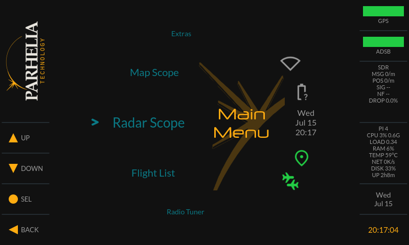

# AeroScan

AeroScan is a self-contained aircraft scanner for the Raspberry Pi: a radar-scope
style Qt GUI showing live ADS-B traffic (RTL-SDR + dump1090) with GPS positioning,
an aviation-chart map overlay, a multi-band radio receiver (FM broadcast, aviation
airband, and 2 m amateur), and WiFi/Bluetooth device management. It runs on a
minimal Buildroot Linux image dedicated to the application. It is a port of the
[avBadge 2024 "Winglet"](https://github.com/AerospaceVillage/avBadge_2024) badge
firmware from its custom Allwinner T113S hardware to commodity Raspberry Pi
hardware.

<p align="center">
  
  <br>
  <em>Main menu (design-system render of the 800×480 instrument UI)</em>
</p>

## Features

The GUI is an 800×480 instrument-style interface driven entirely from four touch
zones — **Up**, **Down**, **A** (select), **B** (back) — or an optional paired
Bluetooth keyboard. From the main menu:

- **Radar Scope** — PPI radar-style sweep plotting live ADS-B aircraft around your
  GPS position.
- **Map Scope** — the same traffic overlaid on aviation chart tiles (airspace,
  airports, NAVAIDs).
- **Flight List** — scrollable list of tracked aircraft.
- **Radio Tuner** — multi-band RTL-SDR receiver (see below). Appears only when a
  second RTL-SDR dongle is present.
- **Extras** — GPS List (satellite/fix detail), GPS Tracker (position plot),
  Clock, OScope, and Media Player (legacy avBadge demo apps).
- **Credits**, **Settings**, and **Power** (poweroff / reboot / restart UI / exit
  to terminal).

### Radio tuner

Runs on a dedicated second RTL-SDR dongle (device 1; device 0 stays on ADS-B, so
there is no coverage gap). Fully operable from the four touch keys:

- **Bands** — FM broadcast (87.9–107.9 MHz, wideband FM), aviation airband
  (118–137 MHz, AM), and 2 m amateur (144–148 MHz, narrowband FM).
- **Squelch** on airband and 2 m, with a per-band threshold that persists.
- **Presets / favorites** stored on-device (`/var/lib/aeroscan/radio_presets.json`)
  with save, rename, delete, and a preset browser.
- **Nearby airport frequencies** for airband, pulled from live FAA NASR data by
  GPS position (TWR/CTAF/GND/ATIS…) and refreshed from Settings → Radio Options →
  Update Radio Data.
- **Volume** works on every audio output — 3.5 mm jack, HDMI, and Bluetooth — via
  an ALSA softvol control.

### Settings

- **WiFi** — scan and join, manual SSID entry, and manage saved networks
  (on-screen keyboard for passphrases).
- **Bluetooth** — pair a keyboard (navigation) or headphones (audio) and manage
  paired devices; pairing runs over BlueZ D-Bus with the passkey shown on screen.
- **UI Options** — brightness, dark mode, ADS-B timeout, 12/24-hour clock,
  SD-card maps, scroll direction, cached GPS position, and cold-boot GPS.
- **System Options** — root password, clear root password, and time zone.
- **Radio Options** — download/refresh the FAA airport frequency database (NASR).
- **Audio** — output routing: headphone jack, HDMI, or Bluetooth headphones.
- **About Device** and **View Release Notes**.

## Hardware

Two build targets are provided: **Raspberry Pi 4** (AArch64, Qt eglfs on KMS/DRM)
and **Raspberry Pi 2** (ARMv7, Qt linuxfb).

**The Pi 4 is the recommended target.** Its USB ports can distribute power to the
display, GPS receiver, and RTL-SDR dongles directly. The Pi 2's onboard USB power
budget cannot handle these peripherals, so using the Pi 2 requires an external
powered USB hub — without one, peripheral power draw causes brownouts and
spontaneous reboots.

| Component | Notes |
|---|---|
| Raspberry Pi 4 (recommended) or Pi 2 Model B | Pi 2 needs a powered USB hub |
| Display | Pi 4: official 7" DSI or compatible clones (auto-detected), or HDMI. Pi 2: Waveshare 800×480 HDMI + XPT2046 resistive touch (SPI) |
| RTL-SDR USB dongle(s) | device 0 = ADS-B 1090 MHz (dump1090); a second dongle (device 1) enables the radio tuner (FM / airband / 2 m) |
| u-blox GPS receiver | NEO-6M or similar, USB serial |
| USB WiFi dongle | RT5370 supported out of the box |
| Bluetooth | Pi 4 uses onboard BT (Pi 2 needs a USB dongle); in-app pairing over BlueZ D-Bus for a keyboard and/or audio headphones |

## Building

Requires a Linux host with the usual Buildroot dependencies (gcc, make, python3,
wget, etc.).

```bash
git clone <this-repo> AeroScan && cd AeroScan
make download-buildroot          # one-time: fetch Buildroot 2024.02

# Map tiles need a free OpenAIP API key (https://www.openaip.net → Account → API Keys)
echo YOUR_OPENAIP_KEY > .openaip-key

make rpi4                        # configure + full build (or: make rpi2)
```

Flash the result to an SD card:

```bash
# oflag=direct + conv=fsync make dd block until data is physically on the
# card — without them, pulling the card early silently corrupts the rootfs
dd if=output/rpi4/images/sdcard.img of=/dev/sdX bs=4M oflag=direct conv=fsync status=progress
```

Useful targets (see `Makefile` for the full list):

| Target | Purpose |
|---|---|
| `make rpi4` / `make rpi2` | Configure + full image build |
| `make menuconfig-rpi4` | Interactive Buildroot config |
| `make savedefconfig-rpi4` | Write config back to the defconfig |
| `make rpi4-<pkg>-rebuild` | Rebuild one package (e.g. `make rpi4-aeroscan-gui-rebuild && make rpi4` after GUI source changes) |
| `make clean-rpi4` | Remove build output |

## Map tiles

Aviation chart tiles (OpenAIP overlay: airspace, airports, NAVAIDs; CONUS,
zoom 7–10) are **not stored in this repository**. They are downloaded
automatically during the build:

- The board `post-build.sh` runs `tools/fetch-aviation-tiles.py`, which fills
  `maps-cache/` at the project root and installs the tiles into the image at
  `/opt/winglet-gui/maps`.
- `maps-cache/` is gitignored and survives `make clean`. The first build spends
  a few hours downloading (~120 MB, rate-limited to respect the OpenAIP free
  tier); later builds resume from the cache and finish instantly.
- The download requires an OpenAIP API key in `.openaip-key` (or the
  `OPENAIP_KEY` environment variable). Without a key the build still succeeds,
  just without map tiles.
- The key is baked into the image at `/etc/aeroscan/openaip.key` so tiles can be
  refreshed on the device later via `aeroscan-fetch-tiles` (or `aeroscan-setup`)
  without rebuilding.

## Airport frequency data (NASR)

The radio tuner's nearby-airport airband frequencies come from the FAA's National
Airspace System Resource (NASR) dataset, not a baked-in file:

- On the device, **Settings → Radio Options → Update Radio Data** runs
  `/usr/libexec/aeroscan/nasr-update.py`, which downloads the current FAA NASR
  edition over WiFi and writes `/var/lib/aeroscan/apt_freq.csv`.
- Data refreshes on the FAA's 28-day cycle; the tuner queries airports within
  20 nm of the current (or last-known) GPS position.
- User favorites are stored separately at `/var/lib/aeroscan/radio_presets.json`,
  seeded on first run from the image's `/usr/share/aeroscan-gui/frequencies.json`.

## First boot

On the first boot the root partition automatically expands to fill the SD
card (`aeroscan-expand-rootfs.service`, runs once early in boot, takes a few
seconds). Boot lands on a tty1 shell (the GUI service is preset-disabled on
the Pi 4 image while the port is under active development). Run `aeroscan-setup` on the
console or over SSH to configure WiFi, display, and hostname, then start the
GUI with `systemctl start aeroscan-gui` or run `aeroscan-gui` directly.

## Repository layout

```
Makefile                  Top-level build entry points (wraps Buildroot)
aeroscan-gui/             Qt5 application source (radar scope, map, radio, settings, …)
buildroot-external/       Buildroot external tree (BR2_EXTERNAL)
  configs/                aeroscan_rpi2_defconfig, aeroscan_rpi4_defconfig
  board/rpi2/, rpi4/      config.txt, cmdline.txt, kernel fragments, rootfs
                          overlays, post-build/post-image scripts
  board/common/overlay/   Shared on-device files (aeroscan-setup,
                          aeroscan-fetch-tiles, NASR updater, seed radio presets)
  package/                aeroscan-gui and rpi4-wifi-firmware packages
tools/                    Host-side tile download scripts
maps-cache/               (gitignored) build-time tile cache
buildroot/, output/       (gitignored) Buildroot tree and build output
```

## Status

- **Pi 2**: display + touch, Qt GUI, ADS-B working; WiFi bring-up in progress.
- **Pi 4**: primary target. Display auto-detection (DSI preferred, HDMI
  fallback), touch input rotation, WiFi and SSH, in-app Bluetooth pairing (BlueZ
  D-Bus, passkey shown on screen) for both keyboards and audio headphones, audio
  output selection (headphone jack / HDMI / Bluetooth), and the multi-band radio
  tuner with squelch, user presets, and live FAA NASR airport frequencies. Code
  complete; on-device verification ongoing.

Further design notes live in `DEVELOPMENT_PLAN.md`.
