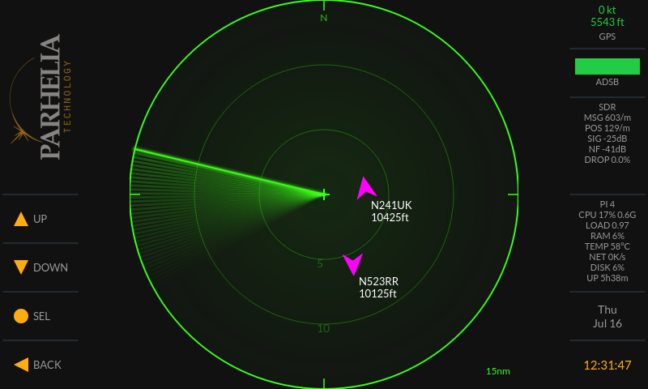
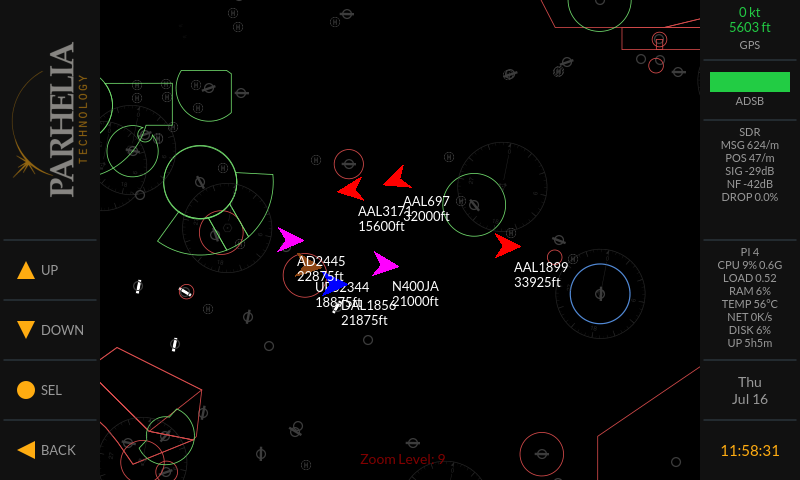
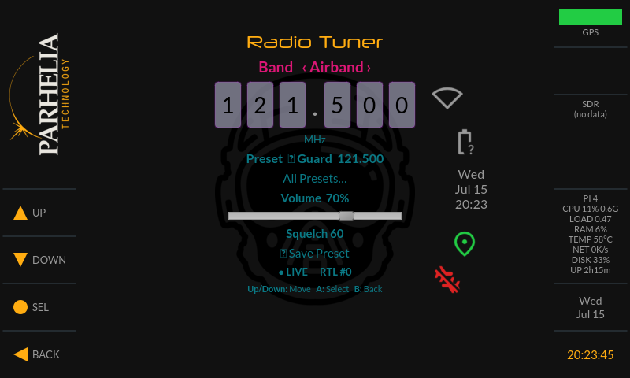
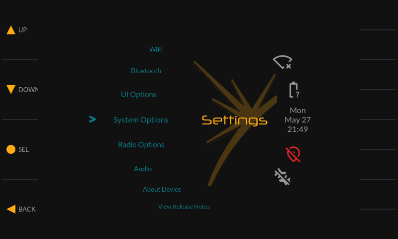

# AeroScan

AeroScan is a self-contained aircraft scanner for the Raspberry Pi: a radar-scope
style Qt GUI showing live ADS-B traffic (RTL-SDR + dump1090) with GPS positioning,
an aviation-chart map overlay, a multi-band radio receiver (FM broadcast, aviation
airband, and 2 m amateur), and WiFi/Bluetooth device management. It runs on a
minimal Buildroot Linux image dedicated to the application. It is a port of the
[avBadge 2024 "Winglet"](https://github.com/AerospaceVillage/avBadge_2024) badge
firmware from its custom Allwinner T113S hardware to commodity Raspberry Pi
hardware.

<p align="center">
  
  <br>
  <em>Main menu — on-device screenshot, 800×480 DSI display: Parhelia touch column,
  arc menu, and the live instrument rail (GPS/ADS-B, SDR stats, Pi vitals, GPS-timezone clock)</em>
</p>

<p align="center">
  
  
  <br>
  
  
  <br>
  <em>Radar Scope, full-width Map Scope with live traffic (DAL/UPS/SWA arrivals
  over the OpenAIP airspace chart), Radio Tuner on 121.500 Guard, and Settings —
  captured on-device (F12 screenshot hotkey)</em>
</p>

## Features

The 800×480 screen is an instrument panel in three columns: a **100 px
Parhelia-branded touch column** on the left (logo above, the four control
zones — **UP**, **DOWN**, **SEL**, **BACK** — in the lower half), a **600 px
main display**, and a **100 px instrument rail** on the right. Everything is
driven from the four touch zones or an optional paired Bluetooth/USB
keyboard. From the main menu:

- **Radar Scope** — classic phosphor P-scope: a glowing sweep with a fading
  decay trail (4-second revolution, fixed 240 px radius), CRT tube-glow,
  range rings at 1/3, 2/3, and full range, cardinal ticks with an N marker,
  and an ownship cross — plotting live ADS-B aircraft with callsign and
  altitude labels. Tracks that stop updating dim after 30 seconds and age
  out at 90.
- **Map Scope** — the same traffic overlaid on aviation chart tiles (airspace,
  airports, NAVAIDs), using the full 600 px width; chart areas missing from
  the tile cache render black instead of failing the view.
- **Flight List** — scrollable list of tracked aircraft with callsign,
  altitude, speed, heading, and distance, plus a cumulative count of every
  aircraft heard since startup.
- **Radio Tuner** — multi-band RTL-SDR receiver (see below). Works with one
  dongle (handing off from ADS-B) or two (alongside ADS-B).
- **Extras** — GPS List (satellite/fix detail), GPS Tracker (position plot),
  Clock, OScope, and Media Player (full-screen, aspect-preserving; legacy
  avBadge demo media plus optional SD-card media).
- **Credits**, **Settings**, and **Power** (poweroff / reboot / restart UI / exit
  to terminal).

### Instrument rail

The right column is a live instrument rail, refreshed every 2 seconds
(top to bottom):

- **GPS readout** — ground speed (knots) and MSL altitude (feet) from the
  GPS, drawn in the fix-status color: green with a fix, amber dashes
  without.
- **ADS-B bar** — amber: connected to the dump1090 feed; green: aircraft
  heard in the last 90 seconds. After a single-dongle tuner session the feed
  reconnects automatically in ~8 seconds.
- **SDR stats** — decoder health from dump1090's rolling one-minute window:
  messages/min, resolved positions/min, mean signal and noise floor (dBFS),
  and sample-drop percentage. The noise floor doubles as an antenna/RF-siting
  meter: ≈ −42 dBFS is a quiet site, ≈ −30 dBFS means local interference is
  drowning reception.
- **Pi vitals** — CPU % and frequency, load average, RAM %, SoC temperature
  (with a `!` flag if the firmware reports throttling/undervoltage), network
  throughput, disk usage, uptime.
- **Date and clock** — 24-hour with seconds, in the timezone derived from the
  GPS position (US zone bands with DST, solar time elsewhere).

Screens also carry compact status icons beside the main display: WiFi
signal, battery, date/time, GPS pin (green fix / red no-fix), and a
three-state ADS-B airplane — **red slashed**: no data feed (dump1090 down or
the dongle borrowed by the tuner); **amber**: feed up, sky quiet; **green**:
aircraft heard.

### Radio tuner

Shares the RTL-SDR hardware with ADS-B. With **two dongles** it runs on device 1
while dump1090 keeps device 0, so there is no ADS-B coverage gap. With a **single
dongle** it hands off: opening the tuner stops dump1090 and takes the dongle, and
returning to an ADS-B screen (Radar/Map Scope, Flight List) restarts dump1090.
Fully operable from the four touch keys:

- **Bands** — FM broadcast (87.9–107.9 MHz, wideband FM), aviation airband
  (118–137 MHz, AM), and 2 m amateur (144–148 MHz, narrowband FM).
- **Squelch** on airband and 2 m, with a per-band threshold that persists.
- **Presets / favorites** stored on-device (`/var/lib/aeroscan/radio_presets.json`)
  with save, rename, delete, and a preset browser.
- **Nearby airport frequencies** for airband, pulled from live FAA NASR data by
  GPS position (TWR/CTAF/GND/ATIS…) and refreshed from Settings → Radio Options →
  Update Radio Data.
- **Volume** works on every audio output — 3.5 mm jack, HDMI, and Bluetooth — via
  an ALSA softvol control.

### Remote SDR server (rtl_tcp)

The device can serve one of its RTL-SDR dongles over the network to desktop
SDR applications — SDR++, GQRX, SDR#, or anything else that speaks the
`rtl_tcp` protocol. The heavy waterfall/demodulation UI runs on your
computer; AeroScan just streams raw samples.

**Enabling it (on the device):** Settings → Radio Options →

1. **Remote SDR Device** — `RTL #1` (default) serves the second dongle and
   leaves ADS-B running on device 0; `RTL #0 (pauses ADS-B)` hands the
   ADS-B dongle to the server, stopping dump1090 until the server is turned
   off again (single-dongle systems use this).
2. **Remote SDR Port** — 1234 (the rtl_tcp convention), 2832, or 7373.
3. **Remote SDR Server** — toggle on. The setting persists across reboots
   (the GUI enables the systemd unit); toggle off to stop and restore ADS-B.

**Connecting (on your computer):**

- **SDR++** — Source: `RTL-TCP`, host `<pi-address>`, port `1234`, Start.
- **GQRX** — Device string: `rtl_tcp=<pi-address>:1234`.
- **SDR#** — Source: RTL-SDR (TCP), address/port as above.

Notes: raw 8-bit IQ at typical sample rates is 30–60 Mbit/s — fine on good
WiFi or Ethernet, but reduce the client's sample rate if the waterfall
stutters. While the server holds a dongle, the on-device radio tuner cannot
open that dongle. And the SDR sees the same RF environment AeroScan does —
including the display panel's interference (see ADS-B reception tips), which
makes a remote waterfall an excellent diagnostic for antenna placement.

**Implementation** (for future work): `rtl-tcp.service` (systemd unit in the
rpi4 overlay, preset-disabled, `SuccessExitStatus=1` because rtl_tcp exits 1
on SIGTERM) reads `DEVICE`/`PORT` from `/etc/default/rtl-tcp`, which
`WingletGUI::applyRtlTcp()` (wingletgui.cpp) rewrites whenever the three
`rtlTcp*` settings change; the same hook performs `systemctl enable/disable
--now` for persistence and the device-0 dump1090 stop/restore handoff.

### Settings

- **WiFi** — scan and join, manual SSID entry, and manage saved networks
  (on-screen keyboard for passphrases); the connected network shows its live
  IP address.
- **Bluetooth** — pair a keyboard (navigation) or headphones (audio) and manage
  paired devices; pairing runs over BlueZ D-Bus with the passkey shown on screen.
- **UI Options** — brightness, dark mode, ADS-B timeout, 12/24-hour clock,
  SD-card maps, scroll direction, cached GPS position, and cold-boot GPS.
- **System Options** — root password, clear root password, and time zone.
- **Radio Options** — download/refresh the FAA airport frequency database
  (NASR), and the Remote SDR server controls (see
  [Remote SDR server](#remote-sdr-server-rtl_tcp)).
- **Audio** — output routing: headphone jack, HDMI, or Bluetooth headphones.
- **About Device** and **View Release Notes**.

## Hardware

Two build targets are provided: **Raspberry Pi 4** (AArch64, Qt eglfs on KMS/DRM)
and **Raspberry Pi 2** (ARMv7, Qt linuxfb).

**The Pi 4 is the recommended target.** Its USB ports can distribute power to the
display, GPS receiver, and RTL-SDR dongles directly. The Pi 2's onboard USB power
budget cannot handle these peripherals, so using the Pi 2 requires an external
powered USB hub — without one, peripheral power draw causes brownouts and
spontaneous reboots.

| Component | Notes |
|---|---|
| Raspberry Pi 4 (recommended) or Pi 2 Model B | Pi 2 needs a powered USB hub |
| Display | Pi 4: Hosyond 5" DSI 800×480 (official-RPi-7"-clone, capacitive touch — default) or Waveshare 4" 480×800 HDMI + XPT2046 resistive touch, selected by one line in `config.txt` (see [Display selection](#display-selection-pi-4)). Pi 2: the Waveshare HDMI panel |
| RTL-SDR USB dongle(s) | one runs ADS-B 1090 MHz (dump1090); the radio tuner (FM / airband / 2 m) hands off from it, or uses a second dongle to run alongside ADS-B |
| u-blox GPS receiver | NEO-6M or similar, USB serial |
| USB WiFi dongle | RT5370 supported out of the box |
| Bluetooth | Pi 4 uses onboard BT (Pi 2 needs a USB dongle); in-app pairing over BlueZ D-Bus for a keyboard and/or audio headphones |

### ADS-B reception tips

The DSI display panel generates broadband RF interference (measured as a
~10 dB noise-floor rise at 1090 MHz) that can drown weak ADS-B signals when
the SDR dongle sits next to it. For greatly improved reception:

- **Use a USB extension cable** to remote the RTL-SDR receiver away from the
  Pi and its display panel — this is the single highest-impact change.
- **Experiment with antenna placement**: elevated, near or outside a window,
  and as far from the electronics as the cable allows.
- Judge each change with the instrument rail's SDR stats: a noise floor
  (`NF`) around **−42 dBFS** means a quiet site, around **−30 dBFS** means
  interference is winning; rising `MSG` and `POS` rates are the payoff.
  (Verified in practice: remoting the receiver away from the panel took
  this site from a jammed −30 dBFS floor with zero decodes to −41 dBFS
  with 1800+ messages and 150+ positions per minute.)
- **Mind USB power on the extension**: a long or thin cable drops voltage,
  and an undervolted dongle can fail its tuner PLL (`[R82XX] PLL not
  locked!` in the dump1090 journal) — the decoder then runs while
  processing zero samples, i.e. an empty sky under heavy traffic. The
  image detects this (red **STALLED** in the rail's SDR block) and
  self-recovers via `aeroscan-sdr-watchdog` (dump1090 restart, then USB
  rebind), but if it recurs the durable fix is a shorter/thicker cable or
  a small powered hub at the receiver end.

## Display selection (Pi 4)

The Pi 4 image supports two panels. The active one is chosen by a single
`include` line in `config.txt` on the SD card's FAT boot partition — editable
on any computer by moving the leading `#`:

```
include display-dsi.txt      # Hosyond 5" DSI, 800×480 landscape (default)
#include display-hdmi.txt    # Waveshare 4" HDMI, 480×800 portrait + XPT2046
```

Each `display-*.txt` carries everything its panel needs — device tree overlays,
touch controller, and (for HDMI) the matching kernel cmdline with console
rotation and hotplug forcing — so swapping panels requires no other edits. The
on-device services (`aeroscan-display-init`, sourced for both the systemd unit
and manual `aeroscan-gui` starts) detect the connected panel at runtime and set
the Qt rotation and touch mapping to match.

The Hosyond panel, like most "official-compatible" DSI clones, emulates the
original ATTiny power-controller I2C protocol and ignores the port-state
protocol the mainline `rpi-panel-attiny-regulator` driver switched to in
Linux 5.16 — stock kernels leave it black at the firmware→kernel handoff, with
no errors anywhere. The image carries a kernel patch
(`buildroot-external/board/rpi4/linux/patches/`) restoring the legacy power-on
sequence. Two helper scripts support display bring-up: `patch-sd-dsi.sh`
patches a flashed card from the host without a rebuild, and
`aeroscan-dsidiag.sh` (installed on-device as `aeroscan-dsidiag`) collects DSI
pipeline state; `aeroscan-drm-init` also dumps display diagnostics to
`/var/log/` on every boot.

## Building

Requires a Linux host with the usual Buildroot dependencies (gcc, make, python3,
wget, etc.).

```bash
git clone <this-repo> AeroScan && cd AeroScan
make download-buildroot          # one-time: fetch Buildroot 2024.02

# Map tiles need a free OpenAIP API key (https://www.openaip.net → Account → API Keys)
echo YOUR_OPENAIP_KEY > .openaip-key

make rpi4                        # configure + full build (or: make rpi2)
```

Flash the result to an SD card:

```bash
./flash-sd.sh /dev/sdX          # unmounts auto-mounts, flashes, verifies
```

(`flash-sd.sh` wraps `dd bs=4M oflag=direct conv=fsync`. Unmounting any
desktop auto-mounted partitions first is essential — writing the raw device
while its old partitions are mounted lets stale filesystem metadata flush
over the fresh image and silently corrupts the rootfs — and the script
fsck-verifies the written card before declaring success.)

Useful targets (see `Makefile` for the full list):

| Target | Purpose |
|---|---|
| `make rpi4` / `make rpi2` | Configure + full image build |
| `make menuconfig-rpi4` | Interactive Buildroot config |
| `make savedefconfig-rpi4` | Write config back to the defconfig |
| `make rpi4-<pkg>-rebuild` | Rebuild one package (e.g. `make rpi4-aeroscan-gui-rebuild && make rpi4` after GUI source changes) |
| `make clean-rpi4` | Remove build output |

## Map tiles

Aviation chart tiles (OpenAIP overlay: airspace, airports, NAVAIDs; CONUS,
zoom 7–10) are **not stored in this repository**. They are downloaded
automatically during the build:

- The board `post-build.sh` runs `tools/fetch-aviation-tiles.py`, which fills
  `maps-cache/` at the project root and installs the tiles into the image at
  `/opt/winglet-gui/maps`.
- `maps-cache/` is gitignored and survives `make clean`. The first build spends
  a few hours downloading (~120 MB, rate-limited to respect the OpenAIP free
  tier); later builds resume from the cache and finish instantly.
- The download requires an OpenAIP API key in `.openaip-key` (or the
  `OPENAIP_KEY` environment variable). Without a key the build still succeeds,
  just without map tiles.
- The key is baked into the image at `/etc/aeroscan/openaip.key` so tiles can be
  refreshed on the device later via `aeroscan-fetch-tiles` (or `aeroscan-setup`)
  without rebuilding.

## Airport frequency data (NASR)

The radio tuner's nearby-airport airband frequencies come from the FAA's National
Airspace System Resource (NASR) dataset, not a baked-in file:

- On the device, **Settings → Radio Options → Update Radio Data** runs
  `/usr/libexec/aeroscan/nasr-update.py`, which downloads the current FAA NASR
  edition over WiFi and writes `/var/lib/aeroscan/apt_freq.csv`.
- Data refreshes on the FAA's 28-day cycle; the tuner queries airports within
  20 nm of the current (or last-known) GPS position.
- User favorites are stored separately at `/var/lib/aeroscan/radio_presets.json`,
  seeded on first run from the image's `/usr/share/aeroscan-gui/frequencies.json`.

## First boot

On the first boot the root partition automatically expands to fill the SD
card (`aeroscan-expand-rootfs.service`, runs once early in boot, takes a few
seconds), then the GUI starts automatically on the display. To drop to a
shell instead, run `systemctl stop aeroscan-gui` over SSH or the serial
console (a getty also remains on tty1 beneath the GUI). `aeroscan-setup`
configures WiFi, display, and hostname from the shell if you prefer that to
the in-app Settings.

The image is hardened for indefinite unattended operation: the GUI respawns
on any crash (power-menu exits excepted — Poweroff/Reboot/Exit do what they
say), a 15-second hardware watchdog reboots the box on kernel hangs, the
journal is capped at 64 MB, screenshots self-prune, and the first boot
expands the filesystem to the full card.

## Repository layout

```
Makefile                  Top-level build entry points (wraps Buildroot)
aeroscan-gui/             Qt5 application source (radar scope, map, radio, settings, …)
buildroot-external/       Buildroot external tree (BR2_EXTERNAL)
  configs/                aeroscan_rpi2_defconfig, aeroscan_rpi4_defconfig
  board/rpi2/, rpi4/      config.txt, cmdline*.txt, display-*.txt selection
                          files, kernel fragments and patches, rootfs
                          overlays, post-build/post-image scripts
  board/common/overlay/   Shared on-device files (aeroscan-setup,
                          aeroscan-fetch-tiles, NASR updater, seed radio presets)
  package/                aeroscan-gui and rpi4-wifi-firmware packages
tools/                    Host-side tile download scripts
maps-cache/               (gitignored) build-time tile cache
buildroot/, output/       (gitignored) Buildroot tree and build output
```

## Status

- **Pi 2**: display + touch, Qt GUI, ADS-B working; WiFi bring-up in progress.
  Not exercised recently — consider it stale.
- **Pi 4**: primary target. Dual-display support (Hosyond DSI default /
  Waveshare HDMI, one-line selector in config.txt, clone-panel kernel patch)
  with per-panel touch and rotation handled at runtime, WiFi and SSH, in-app
  Bluetooth pairing (BlueZ D-Bus, passkey shown on screen) for both keyboards
  and audio headphones, audio output selection (headphone jack / HDMI /
  Bluetooth), the multi-band radio tuner with squelch, user presets, and live
  FAA NASR airport frequencies, and the three-column instrument layout with
  live SDR/system telemetry. The ADS-B pipeline is verified end-to-end
  (including with an injected synthetic aircraft feed); real-world reception
  at the development site is currently limited by suspected local RF
  interference and antenna siting — details, open issues, and untested
  features are tracked in [`RELEASE_NOTES.md`](RELEASE_NOTES.md).

Further design notes live in `DEVELOPMENT_PLAN.md`.
